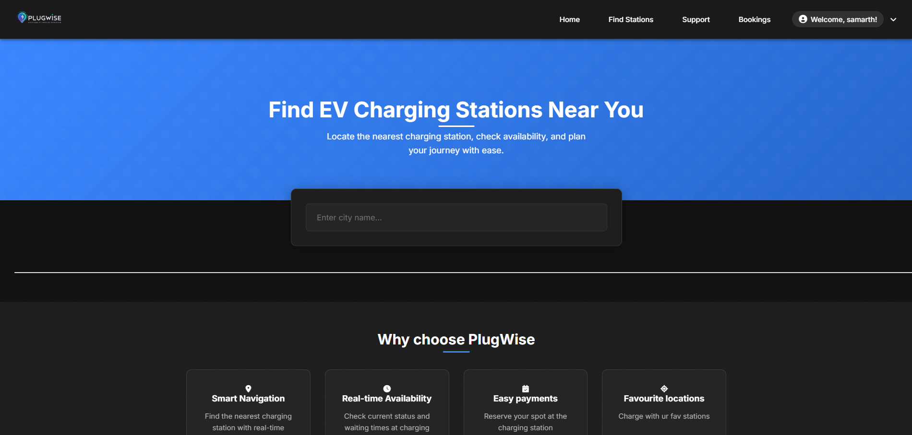
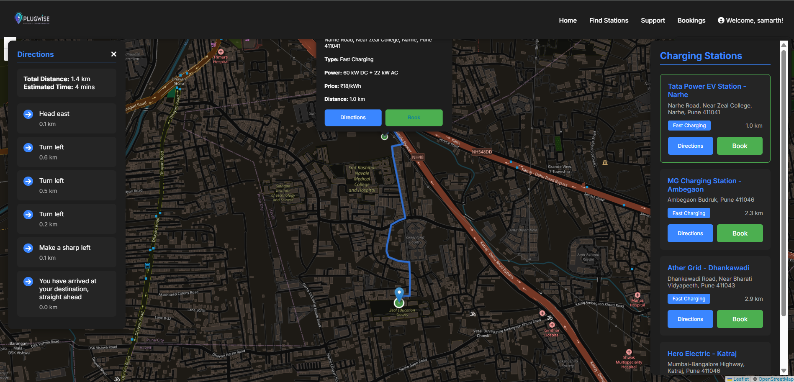
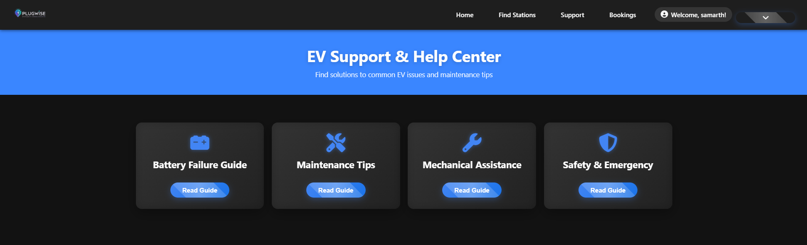
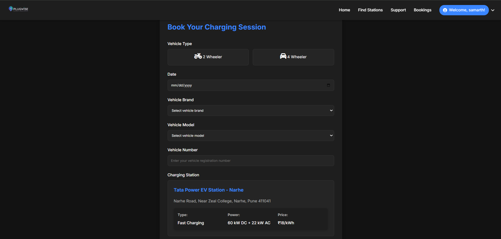
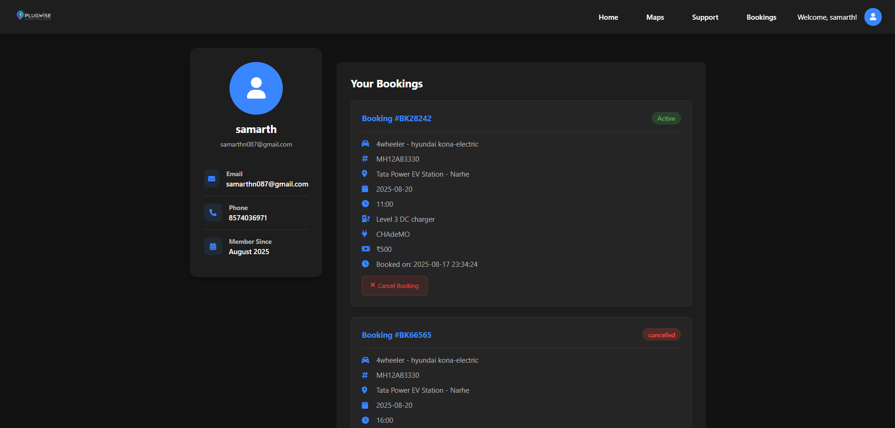
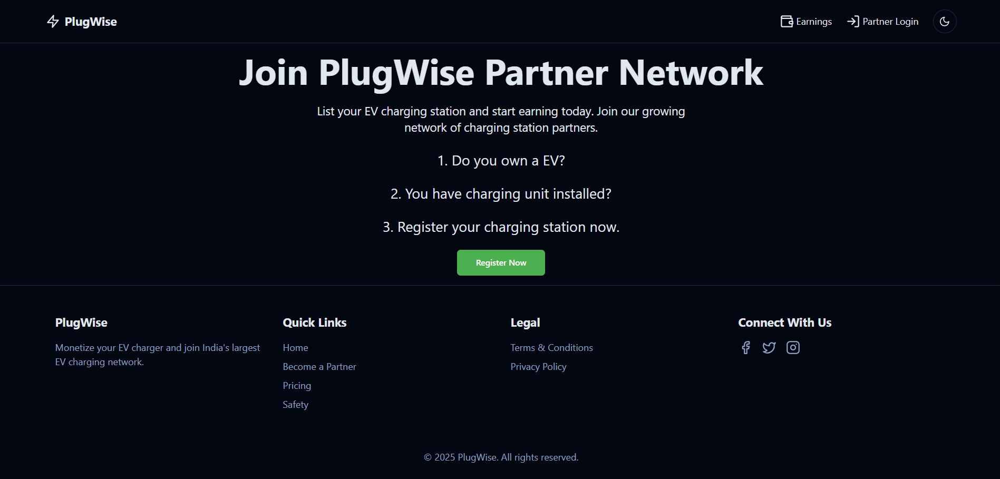

# ⚡ PlugWise – AI-Powered EV Charging & Navigation Platform

> A full-stack EV charging management platform that helps electric vehicle users discover charging stations, navigate using Google Maps, book charging slots, and enables private charger owners to monetize their charging infrastructure.

---

## 🚀 Overview

PlugWise is an AI-powered EV charging platform designed to simplify the electric vehicle charging experience.

The platform enables users to:

- 🔍 Discover nearby charging stations
- 🗺️ Navigate using Google Maps
- 📅 Book charging slots in advance
- 👤 Manage bookings
- 🚗 View charging station details
- 🛠️ Access EV support resources
- 💰 Register as a PlugWise Partner and earn from private chargers

The project was developed as a solution to improve EV charging accessibility and promote sustainable transportation.

---

# 🏆 Achievements

🥈 **2nd Runner-Up**
Eureka Startup Pitching Competition
(E-Cell IIT Bombay & Zeal COER)

🏅 **Finalist**
DIPEX 2025 Project Competition
(COEP Pune)

---

# 📸 Application Screenshots

## 🏠 Home Page



---

## 📍 EV Station Discovery & Navigation

Users can locate nearby charging stations, view station information, and receive navigation directions powered by Google Maps.



---

## 🛠️ EV Support Center

Provides emergency assistance, battery guidance, maintenance tips, and safety recommendations.



---

## 📅 Charging Slot Booking

Users can select vehicle type, choose a charging station, and reserve charging slots.



---

## 👤 User Dashboard

Manage profile information and view active/cancelled bookings.



---

## 💰 PlugWise Partner Program

Private charger owners can register their charging stations and earn passive income.



---

# ✨ Features

### 👤 Authentication

- User Registration
- Secure Login
- Session Management

---

### ⚡ Charging Station Discovery

- Search nearby charging stations
- Live station information
- Distance calculation
- Charger type
- Pricing information

---

### 🗺️ Google Maps Navigation

- Interactive maps
- Route generation
- Turn-by-turn navigation
- Estimated travel distance
- Estimated travel time

---

### 📅 Booking Management

- Slot booking
- Booking history
- Active bookings
- Cancel bookings
- Vehicle details
- Date & Time scheduling

---

### 👤 User Profile

- Profile management
- Booking history
- Account information

---

### 🛠️ EV Support Center

- Battery Failure Guide
- Maintenance Tips
- Mechanical Assistance
- Safety Guidelines
- Emergency Procedures

---

### 💰 PlugWise Partner Network

Allows EV owners to:

- Register charging stations
- Set charging prices
- Earn income
- View earnings
- Join partner network

---

# 🧠 Tech Stack

## Frontend

- HTML5
- CSS3
- JavaScript
- Bootstrap

---

## Backend

- Python
- Flask

---

## Database

- MySQL

---

## APIs

- Google Maps API
- Google Directions API
- REST APIs

---

## Tools

- Git
- GitHub
- VS Code

---

# 🏗️ System Architecture

```
               User

                 │

                 ▼

        HTML • CSS • JavaScript

                 │

                 ▼

             Flask Backend

                 │

      ┌──────────┴──────────┐

      ▼                     ▼

   MySQL Database      Google Maps API

      │                     │

      └──────────┬──────────┘

                 ▼

           Booking Results
```

---

# 🔄 Application Workflow

```
User Login
      │
      ▼
Search Charging Station
      │
      ▼
View Nearby Stations
      │
      ▼
Google Maps Navigation
      │
      ▼
Book Charging Slot
      │
      ▼
Booking Confirmation
      │
      ▼
Booking Dashboard
```

---

# 📂 Project Structure

```
PlugWise/

│── app.py
│── requirements.txt
│── database/
│── templates/
│── static/
│    ├── css/
│    ├── js/
│    ├── images/
│── screenshots/
│── README.md
```

---

# ⚙️ Installation

Clone the repository

```bash
git clone https://github.com/Samarth-Nande/plugwise-ev-charging.git
```

Go to project folder

```bash
cd plugwise-ev-charging
```

Install dependencies

```bash
pip install -r requirements.txt
```

Run Flask

```bash
python app.py
```

Open

```
http://127.0.0.1:5000
```

---

# 📈 Future Enhancements

- AI-based charging station recommendation
- Real-time charger availability
- Online payment gateway integration
- IoT-based charger monitoring
- EV battery health prediction
- Mobile application
- Push notifications
- QR Code charging
- Route optimization using AI

---

# 🎯 Learning Outcomes

This project helped me gain practical experience in:

- Full Stack Development
- Flask Backend Development
- Database Design
- REST API Integration
- Google Maps API
- User Authentication
- Software Architecture
- Responsive Web Design
- Project Deployment
- Git & GitHub

---

# 👨‍💻 Developed By

**Samarth Nande**

Computer Engineering Student

📍 Pune, Maharashtra

GitHub
https://github.com/Samarth-Nande

LinkedIn
https://linkedin.com/in/samarthnande

---

# ⭐ Support

If you found this project useful,

⭐ Star this repository.

Feedback and suggestions are always welcome!
